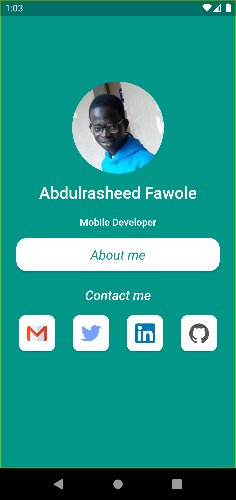
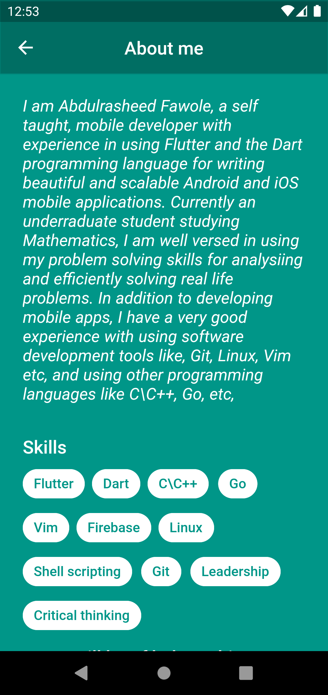

# resume_app

A simple mobile app for my resume.

## Code 💻

The codebase follows the layered architecture folder structure which is as below,

```
lib
├── core
│   ├── constants
│   ├── helpers
│   └── mixins
├── views
└── widgets
```
The `views` folder contains the different pages in the app, and the `widgets` contains the diffenrent shared `Widgets` and components used in the app, which makes it easy to add new screens. 

In the `core` folder we have the different configurations used throught the lifecycle of the app. For example the `mixin` folder contains the `UrlLaunchMixin` which makes it easy to define different methods for the `url_launcher` operations.
```dart
mixin UrlLaunchMixin {
  ///  launches the given [Twitter](https://twitter.com) url
  Future<void> gotoTwitter() async {
    try {
      await launchUrl(twitterUrl);
    } catch (_) {}
  }
  // ... other methods
}
```
with this, it makes it easy to add a new method involving `url_laucher`.

Also, the `helpers` folder contains helper functions used in the app and `constants` contains different constants values used throughout the app.

To add state managements solutions like [flutter_bloc](https://bloclibrary.dev) a new folder can be created say `blocs` which will contains the different `blocs` and states of the app.


## UI design 🎨

The **UI** design follows a minimalistic form of design, as the app comprises of just two pages which is very intuitive enough for easy navigation.

### Screenshots
|Home Page|About me Page|
|---|---|
||| 

## Features
- Two screens that comprises of the home page and about me page.
- Social media links to get acces to the differents media webpages.


## Libraries and Plugins 🔌
A brief description of the libraries used.

|Name | Version | Use|
|---|---|---|
|[url_launcher](https://pub.dev/packages/url_launcher)| ^6.1.6| For launching urls |
|[flutter_svg](https://pub.dev/packages/flutter_svg)| ^1.1.6 | For rendering svg files|


## Challenges
The major challenge faced while working on this project is the choice of the UI design to use, so as to avoid too much dependence on libraries, but after browsing through [Dribbble](https://dribbble.com), I decided to just use the design I came up with.


## Installation 🔨

To install the app on your computer, make sure you have [Flutter](https://flutter.dev) installed on your computer and clone this repository with

```sh
git clone https://github.com/Abdulrasheed1729/resume_app.git
```
the run 
```sh
flutter pub get
```
to get the packages, to run the app run
```
flutter run
```

## Release

[Link to apk file](https://drive.google.com/drive/folders/1M7K-ZzWlAwe21gVsrIYtrk8IdodcqGG4)

## Appetize Link 🔗

[Link to the appetize demo](https://appetize.io/app/mzy6urnl25kv5e4ldibld4oykq?device=pixel4&osVersion=11.0&scale=75)
<!-- ## Getting Started

This project is a starting point for a Flutter application.

A few resources to get you started if this is your first Flutter project:

- [Lab: Write your first Flutter app](https://docs.flutter.dev/get-started/codelab)
- [Cookbook: Useful Flutter samples](https://docs.flutter.dev/cookbook)

For help getting started with Flutter development, view the
[online documentation](https://docs.flutter.dev/), which offers tutorials,
samples, guidance on mobile development, and a full API reference. -->
